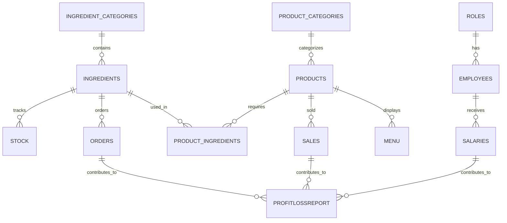
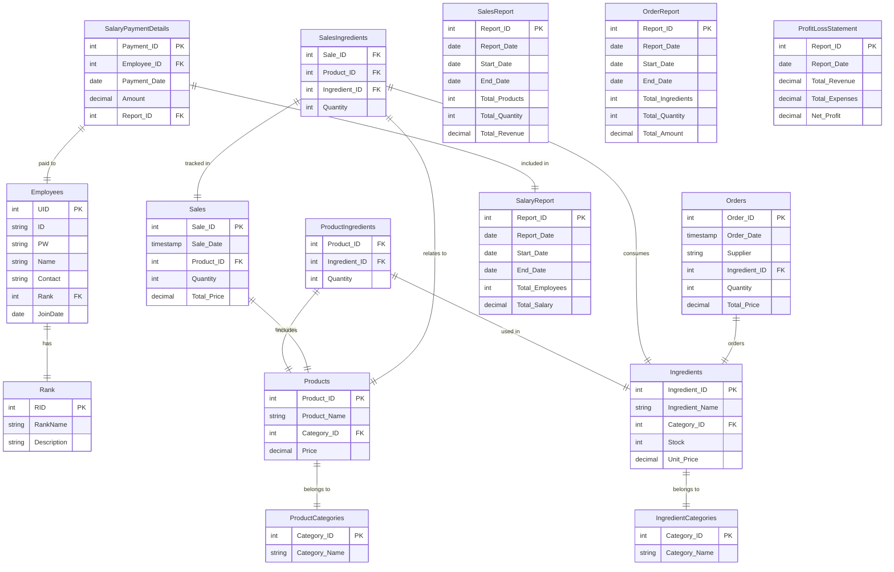
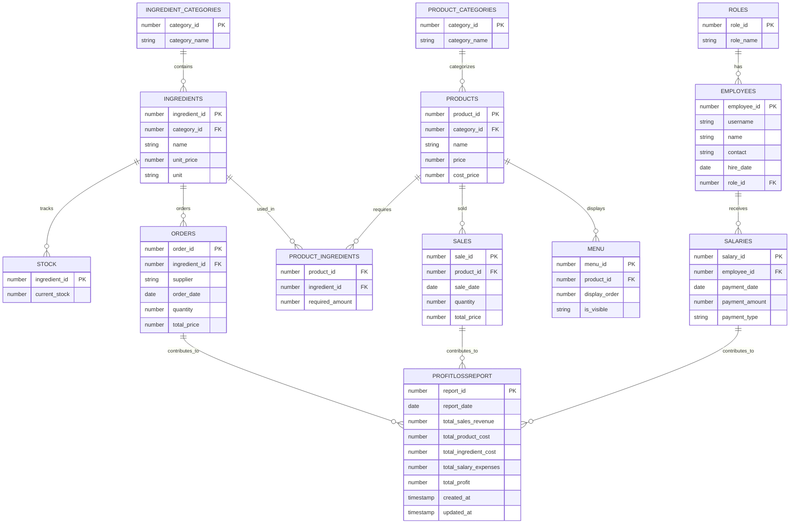

# 매장 관리 프로그램 프로젝트 종료 보고서

## 1. 개요

### 1.1 프로젝트 설명

**프로젝트 이름**: 매장 관리 프로그램

**목적**: 소규모 사업장에서 상품 및 재고를 효율적으로 관리하고, 판매, 주문, 직원 관리 등을 지원하는 프로그램을 제작하기 위함.

**주요 기능**:

- **로그인/직원등록**: 직원 등록 기능을 통해 매장 관리 시스템에 접근하며, 각 사용자 유형에 따라 권한이 다르게 설정됨.

- **재고 관리 및 재료 주문**: 실시간 재고 확인 및 자동 재료 주문 시스템.

- **판매 기능 (포스기 스타일)**: 포스기 스타일의 UI를 통해 상품을 쉽게 추가하고 결제할 수 있는 기능 구현. 판매 내역 실시간 반영.

- 관리자 메뉴 (관리자 전용)

  : 관리자 전용 메뉴에서 재료 및 상품 등록, 직원 정보 관리, 급여 지급 및 다양한 보고서 생성 가능.

  - **재료 및 상품 등록**: 재료와 상품 정보를 관리하고 필요한 정보를 추가, 수정, 삭제할 수 있는 기능.
  - **직원 정보 관리 및 급여 지급**: 직원의 정보를 관리하고 급여 지급 내역 기록 및 관리.
  - **다양한 보고서 생성**: 매출 보고서, 주문 내역 보고서, 급여 지급 보고서를 생성하고 손익 계산서를 통해 매장 운영 현황 확인.

**개발 환경 및 사용 기술**:

- **Java Development Kit (JDK) 17**
- **Oracle Database**

------

### 1.2 시스템 아키텍처

**계층화된 아키텍처**를 채택하여 유지보수성 및 확장성을 고려한 설계를 진행하였고, 아키텍처는 크게 **UI Layer**, **Service Layer**, **Model Layer**, **Database Layer**로 나누어져 있음.

```plaintext
+---------------------------+
|       UI Layer            |
|---------------------------|
| LoginUI, InventoryUI,     |
| SalesUI, ManagerUI,       |
| ProductManagementUI...    |
+---------------------------+
             ↓
+---------------------------+
|     Service Layer         |
|---------------------------|
| CategoryDAO, EmployeeDAO, |
| IngredientDAO, MenuDAO,   |
| ReportDAO...              |
+---------------------------+
             ↓
+---------------------------+
|      Model Layer          |
|---------------------------|
| Category, Employee,       |
| Ingredient, Order,        |
| Product, Stock...         |
+---------------------------+
             ↓
+---------------------------+
|    Database Layer         |
|---------------------------|
| DatabaseService,          |
| DBConnection              |
+---------------------------+
```

- **UI Layer**: 사용자와의 인터페이스 담당 (`LoginUI`, `InventoryUI`, `SalesUI`, `ManagerUI`, `ProductManagementUI` 등)
- **Service Layer**: 데이터베이스와의 상호작용 담당 (`CategoryDAO`, `EmployeeDAO`, `IngredientDAO`, `MenuDAO`, `ReportDAO` 등)
- **Model Layer**: 주요 데이터 정의 (`Category`, `Employee`, `Ingredient`, `Order`, `Product`, `Stock` 등)
- **Database Layer**: 데이터베이스와의 연결 담당 (`DatabaseService`, `DBConnection`)

------

### 1.3 데이터베이스 설계

매장 관리 시스템의 핵심 데이터를 저장하고 관리하는 데이터베이스 설계:

- 주요 테이블 및 관계를 최적화하여 쿼리 성능 향상.
- **손익 계산서** 테이블을 포함한 모든 테이블 간 관계를 명확히 정의하여 확장성을 고려한 설계.



------

## 2. 작업 진행

### **2.1 초기 기획 단계 주요 기능 및 상세 설명**

#### **로그인 및 출근/퇴근 관리**

- **초기 계획**: 직원 ID와 비밀번호를 이용한 로그인 기능을 구현하고, 각 직원의 출근과 퇴근 시간을 자동으로 기록하고 관리하는 기능을 도입할 예정이었음.

- 기능 상세
  - **출퇴근 시간 기록**: 직원이 출근하고 퇴근할 때, 시스템에서 자동으로 해당 시간을 기록하는 방식으로 출퇴근 데이터를 관리.
  - **출근자 확인**: 시스템을 통해 현재 출근 중인 직원들의 목록을 실시간으로 확인할 수 있는 기능을 제공.
  - **권한별 접근 제어**: 관리자는 전체 직원 정보를 확인할 수 있고, 일반 직원은 자신의 정보만 조회할 수 있도록 제한하는 방식으로 보안성을 높임.

#### **직원 관리**

- **초기 계획**: 직원들의 정보를 관리하는 기능으로, 신규 직원 등록, 정보 수정, 퇴직자 처리 등을 포함한 시스템을 구축할 예정이었음. 직원들의 세부적인 정보와 근로 상황을 확인하고 관리할 수 있는 기능을 제공.

- 기능 상세

  :

  - **등록**: 신규 직원을 등록할 수 있는 기능으로, 직원의 사진, 이름, 직책, 연락처 등의 정보를 입력하여 직원 정보를 시스템에 추가.
  - **수정**: 기존 직원의 정보를 수정할 수 있는 기능. 직원의 연락처, 직책 등 변경된 정보를 반영.
  - **삭제**: 퇴직자의 정보를 삭제하거나 비활성화하여 더 이상 조회할 수 없도록 처리.
  - **급여 관리**: 직원의 급여와 보너스 정산 기능을 제공하여, 월별 급여 지급 내역을 관리.
  - **권한 관리**: 직원이 접근할 수 있는 정보와 시스템의 범위를 역할에 따라 제한하는 권한 관리 기능.

#### **메뉴 상품 관리**

- **초기 계획**: 메뉴 상품을 관리하는 시스템을 통해, 재고 상태를 확인하고, 판매 설정 및 이벤트/할인 기능을 관리하는 기능을 도입할 예정이었음.

- 기능 상세

  :

  - **재고 확인 및 수정**: 각 메뉴 항목에 대한 재고를 실시간으로 확인하고, 필요한 경우 재고 수치를 수정할 수 있는 기능.
  - **판매 설정**: 메뉴 항목의 가격 설정 및 할인율 적용, 메뉴 항목의 판매 활성화/비활성화 설정.
  - **판매 관리**: 메뉴 항목의 판매 상태를 활성화 또는 비활성화하여 판매 여부를 조정하는 기능.

#### **재고 관리**

- **초기 계획**: 재료의 재고를 관리하고, 재고 부족 시 자동으로 알림을 보내는 시스템을 구축할 예정이었음. 발주 및 주문 기록을 관리하여 재고를 지속적으로 보충하는 기능을 제공할 예정이었음.

- 기능 상세

  :

  - **재료 재고 관리**: 재료별 재고 상태를 확인하고, 필요에 따라 수정을 할 수 있는 기능을 제공.
  - **주문 기록 관리**: 발주 및 주문 기록을 저장하고, 재고 부족 시 해당 데이터를 기준으로 자동으로 발주가 이루어지도록 설정.

#### **스케줄 관리**

- **초기 계획**: 직원들의 휴가 및 일정을 관리하고, 가게의 이벤트와 주문 스케줄을 조율하는 시스템을 도입할 예정이었음.

- 기능 상세

  :

  - **직원 스케줄 관리**: 직원들의 휴가와 근무 일정을 관리하고, 일정 충돌 시 알림을 제공하는 기능.
  - **가게 이벤트 관리**: 가게에서 진행되는 이벤트와 주문 일정, 재고 연동을 통해 가게 운영을 효율적으로 관리.

#### **인사 관리**

- **초기 계획**: 직원들의 휴가, 병가, 조퇴 등을 신청하고 승인하는 시스템을 포함하여, 직원들의 근로 시간과 관련된 인사 업무를 처리하는 기능을 제공할 예정이었음.

- 기능 상세

  :

  - **휴가, 병가, 조퇴 신청 관리**: 직원이 휴가, 병가, 조퇴를 신청하면 관리자가 이를 승인하거나 반려하는 시스템을 제공.
  - **승인/반려 시스템**: 직원의 인사 요청에 대해 관리자 승인을 통해 처리하며, 반려 시 사유를 기록.

#### **보고서 생성 및 알림**

- **초기 계획**: 월별 매출, 재고 소모, 직원 근무 기록 등 주요 데이터를 요약하여 보고서를 생성하고, 미처리 요청에 대한 알림 기능을 도입할 예정이었음.

- 기능 상세

  :

  - **월별 보고서 생성**: 매출, 재고 소모, 직원 근무 기록 등을 기반으로 월별 보고서를 생성하여, 관리자에게 필요한 정보를 제공.
  - **알림 시스템**: 재고 부족, 미처리 요청 등에 대해 실시간으로 알림을 제공하여 업무의 원활한 진행을 돕는 기능.

------

### **2.2 변경 사항**

#### **초기 기획 대비 제거된 기능**

- **출퇴근 기록**
  - **초기 계획**: 직원들의 출퇴근 시간을 자동으로 기록하고 관리하는 시스템을 구현할 계획이었음.
  - **변경 이유**: 재고 관리 및 판매 시스템에 효율적으로 집중하는 것이 더 중요한 목표로 설정되었으며, 출퇴근 기록 기능은 현재 우선순위에서 제외됨. 추후 프로젝트에서 추가할 수 있는 가능성이 있음.
- **직원 정보 조회**
  - **초기 계획**: 직원들의 상세 정보를 조회할 수 있는 기능을 통해 근무 정보, 급여 내역, 직급 등을 확인하는 기능을 포함할 예정이었음.
  - **변경 이유**: 판매 및 재고 관리 시스템이 우선시되어, 직원 정보 조회 기능을 제외하고 **급여 지급 내역 보고서**로 대체. 이는 매장 내 급여 지출 관리와 관련된 기능을 더욱 효율적으로 제공하기 위해 결정됨.
- **휴가 승인 및 근태 관리**
  - **초기 계획**: 직원들의 휴가 신청 및 승인, 근태 관리 기능을 구현할 계획이었음.
  - **변경 이유**: 시스템의 복잡성을 줄이고, 핵심적인 기능에 집중하기 위해 해당 기능은 제외됨. 향후 기능 확장 시 추가할 가능성이 있음.
- **이벤트 및 할인 적용**
  - **초기 계획**: 특정 상품에 대한 할인 및 이벤트 적용 기능을 구현할 계획이었음.
  - **변경 이유**: 판매 시스템의 안정성 확보와 복잡한 이벤트 및 할인 로직을 구현하기 위한 시간과 자원의 제약으로 인해 해당 기능은 제외됨. 향후 프로젝트에서 확장 가능성 있음.
- **재고 알람 시스템**
  - **초기 계획**: 재고가 일정 수준 이하로 떨어졌을 때 자동으로 알림을 보내는 시스템을 구축할 계획이었음.
  - **변경 이유**: 재고 부족 시 결제 불가능 기능으로 대체되어 알림 시스템은 추후 UI/UX 개선과 함께 추가할 예정.
- **로그인 실패 처리 및 계정 잠금**
  - **초기 계획**: 보안을 강화하기 위해 로그인 실패 시 계정을 잠그고 로그인 보호 기능을 구현할 계획이었음.
  - **변경 이유**: 프로젝트 규모가 작은 점을 고려하여 간단한 로그인 기능으로 대체하고, 보안 기능은 추후 필요 시 추가할 계획.

------

### **2.3 작업 방식의 문제점 및 개선 방향**

#### **초기 자동화 설계의 복잡성 감소**

- **초기 설계**: 시스템의 자동화 비율을 높여 데이터 입력 및 관리 자동화, 실시간 보고서 자동화 등을 구축하려고 계획함.
- **문제점**: 자동화가 과도하게 복잡해졌고, 실제로 필요한 기능이 아니었으며, 관리 시스템에 더 중점을 두는 것이 더 효율적이라고 판단됨.
- **개선 방향**: 초기 설계에서는 자동화보다는 기본적인 **CRUD**(생성, 읽기, 수정, 삭제)와 데이터 관리 기능을 우선적으로 구현하여 시스템의 복잡도를 줄였고, 향후 자동화 기능을 추가하는 방향으로 진행함.

#### **코드 구조 단순화**

- **초기 설계**: 복잡한 설계를 통해 여러 기능을 동시에 처리하려 했고, 여러 모듈을 하나로 통합하는 구조로 계획함.
- **문제점**: 지나치게 복잡한 코드 구조는 유지보수와 기능 추가를 어렵게 만들었음.
- **개선 방향**: **DAO**와 **UI** 계층을 분리하여 각각의 기능을 독립적으로 관리할 수 있도록 변경하였으며, 이를 통해 각 모듈의 책임을 명확히 하고, 향후 기능 확장을 용이하게 했음.

#### **학습 곡선과 진행 속도를 고려한 기술 선택**

- **초기 설계**: 새로운 라이브러리와 기술을 도입하여 기능 구현을 최적화하려 했음.
- **문제점**: 새로운 기술을 도입하면서 발생한 학습 부담과 프로젝트 진행 속도 저하가 발생했음.
- **개선 방향**: **Java Swing**을 사용하여 UI를 구현하고, 불필요한 라이브러리나 복잡한 기술은 제외하여 프로토타입을 제작하고, 이를 바탕으로 본 프로젝트를 진행하여 작업 속도를 높였음.

#### **유지보수성 향상을 위한 아키텍처 개선**

- **초기 설계**: 확장성을 고려하여 복잡한 아키텍처 설계를 하였으나, 실제로는 관리가 어려운 구조가 되었음.
- **문제점**: 초기 설계가 복잡해져서 새로운 기능을 추가하거나 수정하는 데 어려움이 있었음.
- **개선 방향**: 아키텍처를 단순화하고 유연하게 수정할 수 있도록 **DB**, **Model(DTO)**, **Service(DAO)**, **UI** 계층으로 나누어 관리하기 용이한 구조로 개선하였음. 이를 통해 기능 추가가 용이하고, 유지보수성도 향상됨.
------

## 3. 프로젝트 진행 중 발생한 문제 및 해결
### 3.1 주요 문제점 및 해결 과정

- UI/UX 문제

  :

  - **문제**: 화면 갱신 및 데이터 변동 시 조회 기능이 일관되지 않음. 예를 들어, **EventManager**를 사용하여 이벤트를 처리했지만, 새로운 기능 추가 시 수정해야 하는 번거로움이 발생함.

  - **해결**: 각 화면에 조회 및 갱신 버튼을 추가하여 데이터 갱신을 명확히 구현. 이로 인해 사용자가 데이터 변동 사항을 명시적으로 확인할 수 있게 됨.

    **구체적 해결 방안**:

    - **EventManager**를 활용하여 각 화면에서 발생한 이벤트를 처리하고, 특정 데이터 변경 시 이벤트를 발생시켜 다른 화면에서 이를 반영하도록 했습니다.
    - 그러나 **EventManager**로 관리하는 방식은 관리해야 할 기능이 많아져 코드가 복잡해질 수 있어, 현재 프로젝트에서 실질적으로 구현하기엔 시간이 부족하고, 추후 더 큰 프로젝트에서 이 방식을 사용하는 것이 더 효율적이라고 판단하였습니다.

    **추후 참고 사항**:

    - 새로운 프로젝트에서 **EventManager** 패턴을 더 적극적으로 활용하여, 각 화면의 갱신을 **한 곳에서 중앙 관리**할 수 있도록 설계할 계획입니다. 이를 통해 화면 간 갱신 흐름을 명확히 하고, 시스템 확장성 또한 높일 수 있을 것입니다.

    **코드 예시 (UI 갱신 버튼 추가 및 EventManager 사용)**:

    ```java
    // 조회 버튼 추가
    JButton viewButton = new JButton("조회");
    viewButton.addActionListener(e -> refreshTable());
    buttonPanel.add(viewButton);
    
    // 테이블 데이터 갱신
    public void refreshTable() {
        tableModel.setRowCount(0); // 기존 데이터 초기화
        List<Ingredient> ingredients = ingredientDAO.getAllIngredients();
        for (Ingredient ingredient : ingredients) {
            tableModel.addRow(new Object[]{
                    ingredient.getIngredientId(),
                    ingredient.getCategoryName(),
                    ingredient.getName(),
                    ingredient.getUnitPrice(),
                    ingredient.getUnit()
            });
        }
    }
    
    ```

    - **문제 해결**: `refreshTable()` 메소드를 사용하여 **tableModel.setRowCount(0)**로 기존 데이터를 초기화하고, **ingredientDAO.getAllIngredients()**로 DB에서 새로운 데이터를 조회하여 테이블에 갱신하는 방식으로 화면 갱신을 명확하게 구현했습니다.
    - **추가적인 해결책**: **EventManager**는 **UI 갱신 및 데이터 변동 처리**를 보다 효율적으로 관리하기 위한 방식으로, 이벤트 기반으로 화면을 관리할 수 있게 해줍니다. 향후 기능이 확장되면, `EventManager`를 통해 **모든 화면 갱신을 중앙에서 관리**할 수 있게 되며, 이는 코드의 재사용성과 유지보수성을 크게 향상시킬 것입니다.

    **EventManager 코드 예시**:

    ```java


    // EventManager를 사용하여 데이터 갱신
    EventManager.getInstance().notifyListeners(EventTypes.REFRESH_INGREDIENTS);  // 재료 갱신 이벤트 발생

    
    package ui;
    
    import java.util.ArrayList;
    import java.util.HashMap;
    import java.util.List;
    import java.util.Map;
    
    public class EventManager {
        private static final EventManager instance = new EventManager();
        private final Map<String, List<Runnable>> eventListeners = new HashMap<>();
    
        // Singleton Pattern
        private EventManager() {}
    
        public static EventManager getInstance() {
            return instance;
        }
    
        // 이벤트 리스너 추가
        public void subscribe(String eventType, Runnable listener) {
            eventListeners.computeIfAbsent(eventType, k -> new ArrayList<>()).add(listener);
        }
    
        // 특정 이벤트 발생
        public void notifyListeners(String eventType) {
            List<Runnable> listeners = eventListeners.get(eventType);
            if (listeners != null) {
                for (Runnable listener : listeners) {
                    listener.run();
                }
            }
        }
    
        // 등록된 리스너 출력 (디버깅용)
        public void printListeners(String eventType) {
            List<Runnable> listeners = eventListeners.get(eventType);
            if (listeners != null) {
                System.out.println("Listeners for event: " + eventType);
                for (Runnable listener : listeners) {
                    System.out.println(listener);
                }
            } else {
                System.out.println("No listeners for event: " + eventType);
            }
        }
    }
    ```

    **EventTypes 예시**:

    ```java
    package ui;
    
    public class EventTypes {
        public static final String INGREDIENT_UPDATED = "INGREDIENT_UPDATED";
        public static final String PRODUCT_UPDATED = "PRODUCT_UPDATED";
        public static final String EMPLOYEE_UPDATED = "EMPLOYEE_UPDATED";
        public static final String SALES_UPDATED = "SALES_UPDATED";
        public static final String REPORT_UPDATED = "REPORT_UPDATED";
        public static final String REFRESH_INGREDIENTS = "REFRESH_INGREDIENTS";
        public static final String REFRESH_UI = "REFRESH_UI";
        public static final String REFRESH_PRODUCTS = "REFRESH_PRODUCTS"; // 상품 관련 데이터 갱신
        public static final String RECOVERY_COMPLETED = "RECOVERY_COMPLETED";
    }
    ```

    **향후 계획**:

    - **EventManager** 패턴을 사용하는 것은 향후 시스템이 확장되면 더 유용하게 활용할 수 있습니다. 데이터 변경 시, 이를 감지하여 자동으로 UI를 갱신하고, 여러 화면 간의 연결을 유기적으로 관리할 수 있습니다. 그러나 현재 프로젝트에서는 이 방식이 과도하게 복잡할 수 있으므로, **향후 더 큰 규모의 프로젝트에서 이를 확장하여 사용할 계획**입니다.


#### **DB 설계 문제**

- **문제**: 초기 데이터베이스 설계에서 **복잡한 관계와 과도한 테이블 연결**로 인해 데이터 관리가 어려워졌고, 여러 테이블 간의 관계를 명확하게 정리하지 않아 쿼리 성능 저하가 발생할 수 있었음. 특히 손익 계산서 및 관련 테이블들이 복잡한 관계를 가지며 유지보수나 확장이 어려웠음.

##### **초기 DB 설계 예시**


#### **해결**:

- 테이블 관계를 **단순화**하고, **효율적이고 확장 가능한** 구조로 변경하였음.
- **손익 계산서**와 관련된 테이블을 **단순화**하고, 각 테이블 간의 **연결을 명확하게** 정의하여 쿼리 성능을 최적화하였음. 이를 통해 시스템의 관리와 유지보수가 용이해졌음.

##### **변경된 DB 설계 (최적화 후)**

- **손익 계산서 관련 테이블**을 단순화하여 불필요한 중복을 제거하고, 최소한의 정보로 필요한 데이터를 계산하도록 개선.
- **제품과 재료** 간의 관계를 명확히 정의하여 효율적인 재고 관리가 가능하도록 설계.
- **직원, 급여, 매출, 재료 등**의 주요 테이블 간 관계를 **1:1**, **1:N**, **M:N**의 형태로 최적화하여, 쿼리 성능을 개선하고 데이터 처리 속도를 높였음.

##### **변경된 DB 설계 예시**



##### **DB 최적화 해결 과정**:

- **손익 계산서**(ProfitLossReport) 테이블을 단순화하여 여러 테이블에서 정보를 가져오는 대신 **필요한 값만 저장**하도록 변경. 이를 통해 **매출, 제품 비용, 재료 비용** 등을 바로 계산하여 빠르게 쿼리할 수 있게 되었음.
- **재고 및 매출 데이터**를 쉽게 연계할 수 있도록 `SALES`, `PRODUCTS`, `INGREDIENTS` 간의 관계를 간소화하고, 중복 데이터를 최소화하여 **성능 최적화**.
- **재료 관리**는 **INGREDIENTS**, **STOCK**, **ORDERS** 테이블 간의 관계를 명확히 정의하여, **재고 추적과 발주**를 효율적으로 관리할 수 있게 됨.

##### **최종 해결**:

- **효율적인 데이터 조회 및 관리**: 쿼리 성능을 최적화하고, 데이터의 일관성을 유지하면서도 필요한 데이터만 효율적으로 추출할 수 있도록 개선.
- **유지보수 용이**: 단순화된 관계 덕분에 향후 **확장성**을 고려하여 **기능 추가**나 **데이터 변경** 시 용이한 구조로 개선됨.

------
## 4. 향후 개선 방안

- 코드 구조의 리팩토링

  :

  - 각 기능을 독립적으로 관리하는 방식으로 리팩토링을 진행하여, 기능 추가와 유지보수를 용이하게 하고 코드 품질을 지속적으로 개선할 계획임. 예를 들어, **DAO**와 **UI** 계층을 명확히 분리하고, 각 계층에서의 책임을 더욱 명확히 하여 향후 확장성을 고려한 구조로 개선할 예정임.
  - 또한, 중복된 코드를 최소화하고, 관련된 기능을 모듈화하여 코드 가독성을 높이고, 향후 다른 팀원들이 작업하기 더 편리한 환경을 조성할 계획임.

- 매장 관리 관련 기능 확장

  :

  - 향후 추가적으로 개발될 **키오스크 애플리케이션**은 매장 운영의 효율성을 높이는 데 중요한 역할을 할 예정임. 이를 통해 고객이 직접 주문하고 결제할 수 있는 시스템을 도입하여, 직원들의 업무 부담을 줄이고, 고객의 대기 시간을 단축할 수 있음.
  - **주방 알림 시스템**은 주방에서 주문 내역을 실시간으로 확인할 수 있도록 하여, 주문이 들어오면 주방 모니터에서 즉시 알림을 통해 상품 제작을 시작할 수 있도록 할 예정임. 이를 통해 주방의 작업 흐름을 개선하고, 더 정확한 시간에 상품을 제공할 수 있게 됨.
  - **직원 관리 시스템**도 향후 사업 확장에 맞추어 추가될 예정임. 특히, 직원 수가 많아짐에 따라 **근태 관리**, **급여 처리** 및 **승진 관리** 등의 기능을 포함하여, 매장 운영을 보다 효율적으로 관리할 수 있도록 할 계획임.

------

## 5. 협업

### 5.1 협업 방식

초기 단계에서는 기능을 각자 분담하여 병합하는 방식으로 개발을 진행하려 했음. 그러나 **MVC 패턴** 및 각 개발자의 개발 견해 차이로 인해 협업에 어려움이 있었음. 또한, **협업 툴**을 사용하지 않았기 때문에 병합 시 발생하는 충돌과 작업 방향에 대한 논의가 미흡했던 점이 문제였음. 그 결과, 기존에 진행 중이던 애플리케이션의 확장 기능을 독립적으로 개발하게 되었음. 즉, 하나의 애플리케이션 내에서 기능을 분담하지 않고, 각 기능을 독립적으로 개발하여 병합 시 충돌을 피하려는 방식으로 진행됨. 이 문제를 해결하기 위해 향후 프로젝트에서는 병합 계획을 사전에 세우고, 각 팀원들에게 작업을 분배한 후 철저한 병합 작업을 진행할 예정임. 또한, 초기 기획 단계에서부터 전체적인 구조와 데이터 흐름을 명확히 정의하여 각 팀원 간의 의사소통을 강화할 계획임.

### 5.2 향후 협업 개선 방향

- **초기 설정과 테스트를 철저히 진행한 후 작업에 들어가야 함**:
  - 초기 기획과 DB 설계를 명확히 정의하고, 이를 기반으로 충분한 테스트를 진행하여 개발 중 발생할 수 있는 문제를 최소화할 예정임. 특히, 병합 작업 전에 기능 별 테스트를 철저히 진행하여 이후 단계에서 발생할 수 있는 충돌을 줄이려 할 것임.
- **협업 툴을 적극 활용하고, 명확한 업무 분담을 통해 효율적인 진행을 도모함**:
  - 향후 프로젝트에서는 **Trello**, **JIRA**와 같은 협업 툴을 적극적으로 활용하여 팀원 간의 업무를 체계적으로 관리하고, 각자 맡은 업무를 명확히 분배하여 프로젝트가 체계적으로 진행되도록 할 예정임. 또한, 각 기능에 대해 세부적인 업무 분담과 우선순위를 설정하여 전체적인 작업 흐름을 개선할 계획임.
- **정기적인 회의와 코드 리뷰를 진행함**:
  - 일정 주기로 팀 회의를 열어 진행 상황을 공유하고, 코드 품질을 높이기 위해 코드 리뷰를 진행할 예정임. 코드 리뷰를 통해 각 팀원 간의 피드백을 주고받으며, 코드 품질을 지속적으로 향상시킬 수 있도록 할 계획임.
- **버전 관리 시스템을 활용함**:
  - **Git**과 같은 버전 관리 시스템을 적극적으로 사용하여 코드 변경 사항을 효과적으로 관리하고, 작업 충돌을 방지할 예정임. **Git 브랜치 전략**을 명확히 정의하여, 각 팀원들이 효율적으로 작업할 수 있도록 할 계획임. 예를 들어, **개발 브랜치**와 **배포 브랜치**를 나누어 작업하고, **PR(풀 리퀘스트)** 리뷰를 통해 코드의 품질을 지속적으로 점검할 예정임.
- **공통 개발 기준을 설정함**:
  - 코드 스타일, 네이밍 규칙 등 **공통 개발 기준**을 설정하여 코드의 일관성을 유지하고, 유지보수 및 확장성을 높이기 위한 방안을 마련할 예정임. 이를 통해 각 팀원이 작성한 코드가 일관된 규칙을 따르며, 프로젝트의 확장성과 유지보수성을 높일 수 있음.
- **문서화 및 개발 환경을 공유함**:
  - 개발 중 발생한 문제 해결 과정과 프로젝트 환경 설정에 대한 문서를 작성하여 팀원들이 원활하게 작업을 시작할 수 있도록 도울 예정임. 또한, 개발 환경에 대한 정보를 공유하여, 팀원들이 서로 일관된 개발 환경에서 작업할 수 있도록 할 예정임.
------

## 결론

이번 프로젝트는 매장 관리 시스템을 효율적으로 구축하고 관리하는 것을 목표로 진행되었음. **초기 설계**에서 발생한 **과도한 자동화** 및 **기능 복잡성** 문제를 해결하고, **핵심 기능에 집중**하여 **효율적인 시스템**을 구현했음. **UI/UX**와 **DB 설계**에서 발생한 문제를 해결하며, 향후 **기능 확장** 및 **유지보수성**을 고려한 설계를 했음. 이번 프로젝트에서 얻은 경험을 바탕으로 향후 **협업 툴**을 **효율적으로 활용**하고 **기능 확장**을 위한 **명확한 기준 설정**을 할 수 있을 것임.
